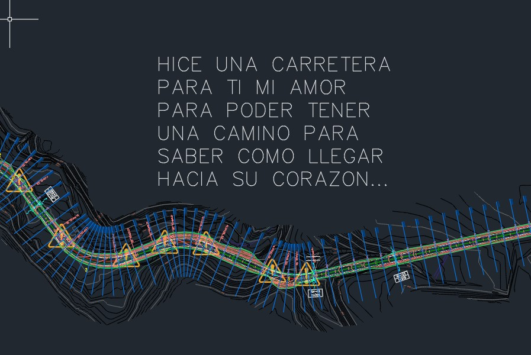
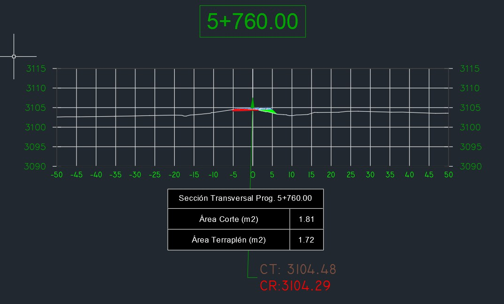

<!DOCTYPE html>
<html lang="es">
<head>
    <meta charset="UTF-8">
    <meta name="viewport" content="width=device-width, initial-scale=1.0">
    <title>Para Ti</title>
    
</head>
<body>

    

        
"AHORA IGNORAME A VER....."

        

            

            
PARA EL AMOR DE MI VIDA

        

    

    

        <button class="boton-tab activo" onclick="cambiarTab(0)">❤️ Mi amor....</button>
        <button class="boton-tab" onclick="cambiarTab(1)">🎵 Me siento asi...</button>
        <button class="boton-tab" onclick="cambiarTab(2)">🚧 Una carretera para el amor de mi vida...</button>
    

    

        ❤️
        <h1 id="titulo-dinamico">Para Wendy</h1>
        
        

            
Mi amor...

No sé qué está pasando y, siendo sincero, estoy muy preocupado. Este silencio no se siente normal para mí y lo único que quisiera saber es si estás bien. Si hay algo que pasó, si hice algo que te lastimó o simplemente necesitas espacio, solo te pido que me lo digas cuando te sientas lista. Prefiero una verdad que duela antes que imaginar mil cosas.

Quisiera que habláramos en persona. Si hace falta, yo voy hasta donde estés. No quiero discutir ni presionarte; solo quiero escucharte, entender qué está pasando y hablar contigo con calma.

No quiero perder lo que hemos construido. Te amo muchísimo, Wendy, y por eso sigo aquí. Creo en nosotros y quiero luchar por esto, pero también quiero hacerlo de la manera correcta: escuchándote y respetando lo que sientes.

Si en algún momento te hice sentir mal, de verdad lo siento. Sé que me equivoco, como cualquier persona, pero también sé reconocer mis errores y quiero aprender de ellos. Lo único que busco es ser una mejor persona para ti y para el futuro que soñaba construir contigo.

Solo quería que supieras cómo me siento. No escribo esto para hacerte violentar ni para obligarte a responder; lo hago porque te amo y porque me importas de verdad.

Espero de corazón que estés bien. Cuando quieras hablar, aquí voy a estar.

Y, por favor, nunca dudes de esto: te amo muchísimo y siempre voy a desear lo mejor para ti.

        

        

            

                
"-7 canciones para dedicar( de hecho son mas pero ahora estoy contabilizando) AJAJAJAJ"

                
                

                    
"Yo me siento asi contigo mi amor y tu lo sabes es una de la primeras canciones que te dedique pero enserio gracias mi amor por estar en mi vida, y por hacerme cambiar la perspectiva en muchas cosas.."

                    <audio id="audio6" src="cancion6.mp3"></audio>
                    <button class="boton-reproductor" onclick="controlarAudio('audio6', 30, 180)">
                        ▶ Canción 6
                    </button>
                

                

                    
"Y hoy me siento asi escuchala de verdad es mi manera mas honesta de decir todo lo que quiero contigo"

                    <audio id="audio7" src="cancion7.mp3"></audio>
                    <button class="boton-reproductor" onclick="controlarAudio('audio7', 45, 183)">
                        ▶ Canción 7
                    </button>
                

                

                    
Y quiero que sepas algo más...
Soy muy miedoso, tú lo sabes. Me pongo muy nervioso con todo esto y, aunque no siempre lo parezca, me cuesta muchísimo decirte cómo me siento. Abrirme de esta manera no es algo que me salga natural.

Todo esto es nuevo para mí. Nunca había querido construir algo tan en serio con alguien y, muchas veces, no sé cuál es la forma correcta de reaccionar. Pero te juro que siempre intento pensar las cosas antes de actuar contigo. No tomo decisiones a la ligera, porque lo nuestro es demasiado importante para mí.

Tal vez suene un poco tonto, pero hasta me pongo a ver videos de psicología en TikTok jajaja. Hay una cuenta que sigo mucho(psialap) porque quiero entenderme mejor, aprender a comunicarme mejor y dejar atrás cosas que sé que debo cambiar. No lo hago porque alguien me obligue; lo hago porque quiero ser una mejor persona y porque sueño con tener un futuro contigo.

No pretendo que pienses que soy perfecto, porque no lo soy. Solo quiero que que veas el esfuerzo que estoy haciendo. Hay días en los que tengo miedo de equivocarme, miedo de decir algo que no debía o de perderte por no saber expresar lo que siento. Aun así, sigo intentándolo porque para mí tú vales ese esfuerzo.

También me identifico con esa idea de intentar ser mejor que ayer. No porque alguien me lo exija, sino porque quiero crecer como persona. Quiero aprender a comunicarme mejor, a manejar mis inseguridades y a no dejar que mis miedos dañen algo tan bonito como lo que siento por ti.

No sabes cuánto me preparo antes de hablar contigo o antes de escribirte algo importante. A veces hasta ensayo en mi cabeza lo que quiero decir para no hacerlo mal jajaja. Puede sonar exagerado, pero es porque eres una de las personas más importantes que han llegado a mi vida y de verdad quiero cuidar lo que estamos construyendo.

Solo quería que supieras eso.

                    <audio id="audio8" src="cancion8.mp3"></audio>
                    <button class="boton-reproductor" onclick="controlarAudio('audio8', 196, 260)">
                        ▶ así me siento de depre....
                    </button>
                

            

        

        

            

                
🚧 UNA CARRETERA PARA EL AMOR DE MI VIDA 🚧

                
                

                    
                    
"Una carretera bien diseñada conecta destinos; tú conectaste mi presente con el futuro que quiero construir."

                

                

                    
                    
"Entre todas las secciones transversales que he dibujado, la única que de verdad quiero estudiar es el camino que me lleva a tu corazón."

                

                
si lo hice jajajaj te paso el documneto ok no JJAJAJAJA y bueno wendy decirte que de verdad te amo mucho mi amor....

            

        

        
Con amor, Leonardo

    

    
</body>
</html>
